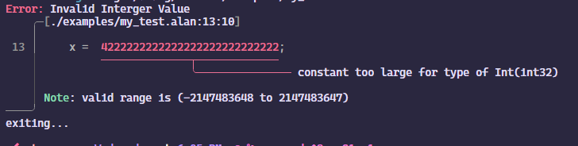

# Alan Compiler 
[](https://github.com/purpl3F0x/compilers/actions/workflows/rust.yml) 
[](https://opensource.org/licenses/Apache-2.0)


Compiler of the Alan programming language, developed for the 8th semester's Compilers course at NTUA.

## Author ✍️

[Stavros Avramidis](https://www.github.com/purpl3F0x)

___
The project contains 3 subdirectories (subcrates).
- **[alan](./alan/)**: The compiler backend for the Alan language
- **[alanc](./alanc/)**: The cli frontend of the compiler
- **[stdlib](./stdlib/)**: The Alan standard library, writen in C (which at it's current state relies on libc, so we can target every plattform &/ architecture)
___

## Build Instructions 🛠️
(Not as detailed as IKEA furnitures)

### Requirements

#### LLVM - Clang
The project is requires and pre-configured to use LLVM 18.

If llvm is not in the default path `LLVM_SYS_180_PREFIX` should be set. <br>
If you want to use any other version of llvm, [Cargo.toml](./alan/Cargo.toml) of alan crate should be configured accordingly.

In addition, llvm-sys will <u>**try**</u> to link llvm staticaly, (platforms such Arch will be built with dynamic llvm libraries)

### Building

Clone the project

```bash
git clone https://github.com/purpl3F0x/compilers.git
```

Go to the project directory

```bash
cd compilers
```

Run with cargo
```bash
cargo run alanc --release -- <Program arguments>
```

Build with cargo
```
cargo build --release
```
__Warning__: *By default x86 release builds are build for x86_64_v3 (avx,avx2) with lto*

## Install 🚀
If you want to install the *alanc* globally:
```bash
cargo install
```

## Usage 💡
Run the program with `-h/--help` and you'll learn everything you need to know, on how to use it. 

Run it with `--version`, if you want to chase some dragons. 

## Features ✨
- (Ridiculously) fast lexing, using [Logos](https://github.com/maciejhirsz/logos)
    
- Errors made for humans, thanks to [chumsky](https://github.com/zesterer/chumsky) parser combinator + [ariadne](https://github.com/zesterer/ariadne)
    

## Known Bugs ☠️
- [ ] Parsing lower bound negative integer (f.ex -2147483648 for 32b ints)

- [ ] Pour diagnostic messages (LLVM hard erroring), when putting expressions after confitional statemtments that all their branches return. For example
    ```pl
    main() : proc
        x: int;
    {
        if (x > 0) return;
        else return;

        return;
    }

##
`
Copyright 2024 Stavros Avramidis
`

